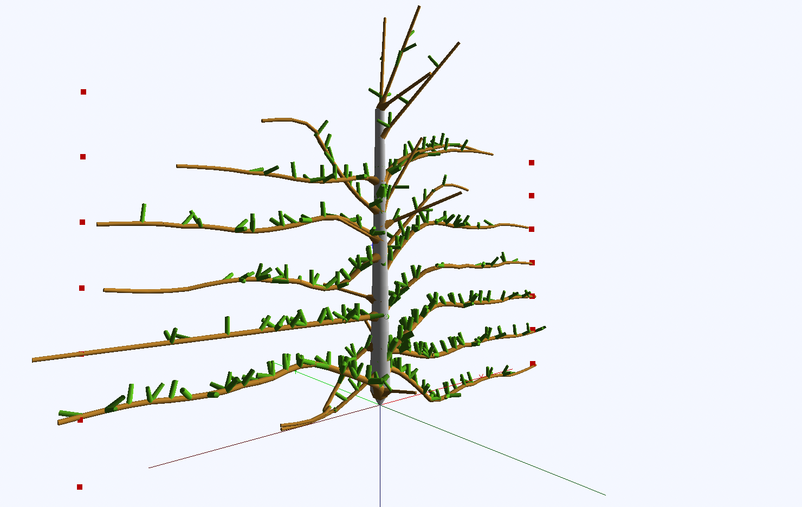
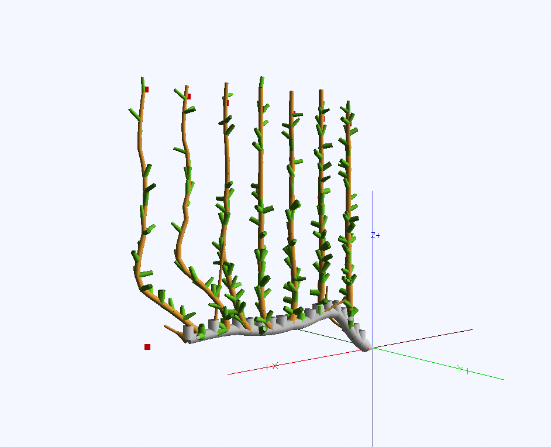

============
TreeSim_Lpy
============

TreeSim_Lpy is a tree modelling tool which is built upon L-py with the added features of pruning
and tying trees down to mimic different architectures. The tool uses python and prior knowledge of L-systems
and L-Py is needed to work with this tool. You can find the L-Py documentation at 
<https://lpy.readthedocs.io/en/latest>

========
Gallery
========

   
   Example of a labelled, pruned and tied envy tree system using TreeSim_Lpy
  
  

   
   Example of a labelled, pruned and tied UFO tree system using TreeSim_Lpy
  

The documentation is provided at https://treesim-lpy.readthedocs.io/en/latest/

=============
Documentation
=============

Documentation is available at `<https://treesim-lpy.readthedocs.io/en/latest/>`_

Help and Support
----------------

Please open an **Issue** if you need support or you run into any error (Installation, Runtime, etc.).
We'll try to resolve it as soon as possible.

==============
Citations
==============

   - F. Boudon, T. Cokelaer, C. Pradal, P. Prusinkiewicz and C. Godin, L-Py: an L-system simulation framework for modeling plant architecture development based on a dynamic language, Frontiers in Plant Science, 30 May 2012.

